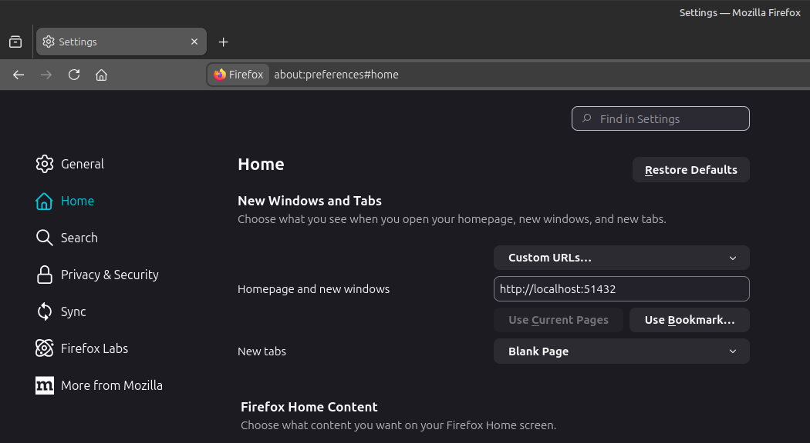
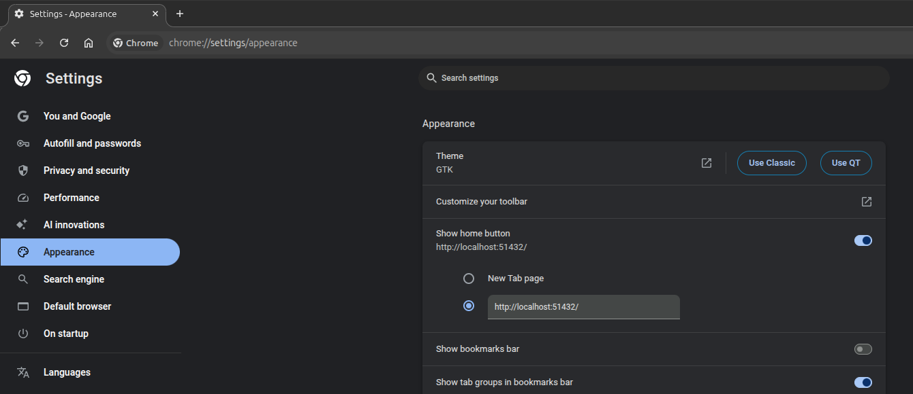

# About

A small website designed to be locally hosted and used as a browser homepage.

It includes:
- a customizable links page for quickly navigating to frequently used websites
- a notes app
- highly customizable color schemes

# Installing

## 1.
TODO: update this now that the site is no longer static :)

```bash
# clone the repo.
# (you could also download as a zip folder, extract, and open a terminal in that folder)
git clone https://github.com/pancake423/custom-homepage.git
cd custom-homepage

# download project dependencies
npm install

# use pm2 to run this application on startup (linux)
# see pm2-installer (https://github.com/jessety/pm2-installer) on windows
npm install pm2 -g
pm2 startup # make sure to run the command it generates...

# start the app
pm2 run index.js --name custom-homepage

# relaunch the currently running apps on startup
pm2 save
```

## 2.
In your browser settings, find the homepage settings and set it to the custom url from above (http://localhost:51432).

### Firefox
go to `about:preferences#home`.



### Chrome

go to `chrome://settings/appearance`. turn on "show home button", and set it to the custom url.



### Other Browsers

 Most (all?) browsers support custom homepages. Look up specific instructions online if you're having trouble.

# Attributions

Icons from [Bootstrap](https://icons.getbootstrap.com/) and [SVGRepo](https://www.svgrepo.com/)
