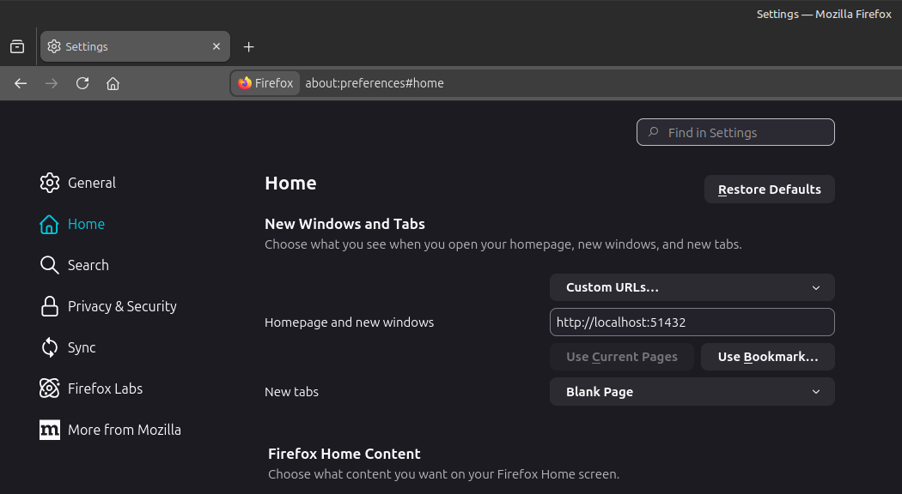
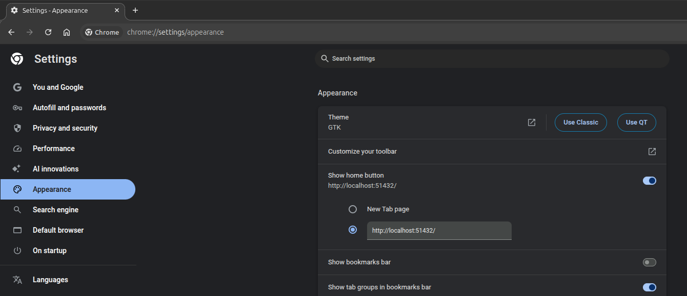

# About

A small website designed to mostly work offline, used as a browser homepage.

It includes:
- a customizable links page for quickly navigating to frequently used websites
- a notes app
- highly customizable color schemes
- cross-device cloud syncing (coming soon?)

# Usage

This project is hosted on my personal website at https://homepage.wxj.me.
feel free to bookmark that page to use as a homepage (see **Setting a homepage** below)

## Development/Local install
If you want to run the site locally, or want to develop it, follow these instructions.

```bash
# clone the repo.
git clone https://github.com/pancake423/custom-homepage.git
cd custom-homepage

# download project dependencies
npm install

# use the development .env file
cp .env.development .env

# start the development server.
npm run start

# you could also set up the server to run on startup with pm2 or a similar service.
```

the development server runs at http://localhost:51432. If you need a
different port, it can be changed in `.env`.

The server uses some of the latest features of Node (builtin SQLite support), so I recommend
using at least node v24.15.0 (the latest LTS release).

## Setting a homepage
In your browser settings, find the homepage settings and set it to the url from above (https://homepage.wxj.me, or http://localhost:51432 for local development).

### Firefox
go to `about:preferences#home`.



### Chrome

go to `chrome://settings/appearance`. turn on "show home button", and set it to the custom url.



### Other Browsers

 Most (all?) browsers support custom homepages. Look up specific instructions online if you're having trouble.

# Attributions

Icons from [Bootstrap](https://icons.getbootstrap.com/) and [SVGRepo](https://www.svgrepo.com/)
